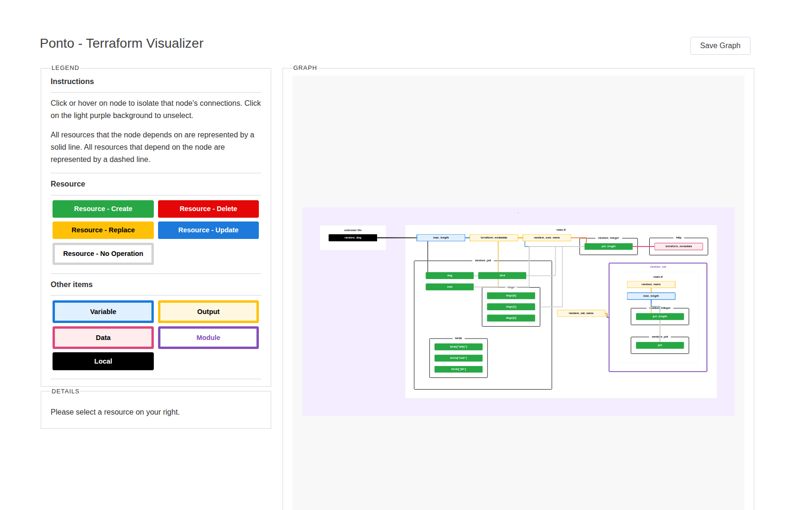

# Ponto - Terraform Visualizer

Ponto is a [Terraform](http://terraform.io/) visualizer. It is a fork of the
excellent but abandoned [Rover](https://github.com/im2nguyen/rover) by Nguyen
Nguyen and contributors, released under the MIT license (see `LICENSE`).

In order to do this, Ponto:

1. generates a [`plan`](https://www.terraform.io/docs/cli/commands/plan.html#out-filename) file and parses the configuration in the root directory or uses a provided plan.
1. parses the `plan` and configuration files to generate three items: the resource overview (`rso`), the resource map (`map`), and the resource graph (`graph`).
1. consumes the `rso`, `map`, and `graph` to generate an interactive configuration and state visualization hosts on `0.0.0.0:9000`.



## Quickstart

The fastest way to get up and running with Ponto is through Docker.

Run the following command in any Terraform workspace to generate a visualization. This command copies all the files in your current directory to the Ponto container and exposes port `:9000`.

```
$ docker run --rm -it -p 9000:9000 -v $(pwd):/src ghcr.io/1stvamp/ponto
2021/07/02 06:46:23 Starting Ponto...
2021/07/02 06:46:23 Initializing Terraform...
2021/07/02 06:46:24 Generating plan...
2021/07/02 06:46:25 Parsing configuration...
2021/07/02 06:46:25 Generating resource overview...
2021/07/02 06:46:25 Generating resource map...
2021/07/02 06:46:25 Generating resource graph...
2021/07/02 06:46:25 Done generating assets.
2021/07/02 06:46:25 Ponto is running on 0.0.0.0:9000
```

Once Ponto runs on `0.0.0.0:9000`, navigate to it to find the visualization!

### Run on Terraform plan file

Use `--plan-json-path` to start Ponto on Terraform plan file. The `plan.json` file should be in Linux version - Unix (LF), UTF-8.

First, generate the plan file in JSON format.

```
$ terraform plan -out plan.out
$ terraform show -json plan.out > plan.json
```

Then, run Ponto on it.

```
$ docker run --rm -it -p 9000:9000 -v $(pwd)/plan.json:/src/plan.json ghcr.io/1stvamp/ponto:latest --plan-json-path=plan.json
```

### Standalone mode

Standalone mode generates a `ponto.zip` file containing all the static assets.

```
$ docker run --rm -it -p 9000:9000 -v "$(pwd):/src" ghcr.io/1stvamp/ponto --standalone
```

After all the assets are generated, unzip `ponto.zip` and open `ponto/index.html` in your favourite web browser.

### Set environment variables

Use `--env` or `--env-file` to set environment variables in the Docker container. For example, you can save your AWS credentials to a `.env` file.

```
$ printenv | grep "AWS" > .env
```

Then, add it as environment variables to your Docker container with `--env-file`.

```
$ docker run --rm -it -p 9000:9000 -v "$(pwd):/src" --env-file ./.env ghcr.io/1stvamp/ponto
```

### Define tfbackend, tfvars and Terraform variables

Use `--tf-backend-config` to define backend config files and `--tf-vars-file` or `--tf-var` to define variables. For example, you can run the following in the `example/random-test` directory to overload variables.

```
$ docker run --rm -it -p 9000:9000 -v "$(pwd):/src" ghcr.io/1stvamp/ponto --tf-backend-config test.tfbackend --tf-vars-file test.tfvars --tf-var max_length=4
```

### Image generation

Use `--gen-image` to generate and save the visualization as a SVG image.

```
$ docker run --rm -it  -v "$(pwd):/src" ghcr.io/1stvamp/ponto --gen-image
```

Image generation needs chromium, which is only in the standard image. The `:slim` image cannot generate images (see below).

SVG is the default. For a raster image use `--image-format png`, and set the output name (without extension) with `-o/--output` (defaults to `ponto`). The same buttons ("Save Graph" for SVG, "Save PNG" for PNG) are in the UI too.

#### From a pre-generated plan (CI / pipelines)

In a pipeline you usually already have a plan and the credentials sit with the
job that produced it, not with Ponto. Generate the plan JSON in that job, then
hand it to Ponto with `--plan-json-path` so Ponto never runs `terraform init`/`plan`
and needs no provider or backend credentials:

```
$ terraform plan -out plan.tfplan
$ terraform show -json plan.tfplan > plan.json
$ docker run --rm -v "$(pwd):/src" ghcr.io/1stvamp/ponto --gen-image --plan-json-path plan.json
```

Ponto reads `plan.json`, writes `ponto.svg`, and exits. Attach the SVG to the
job output (add `--image-format png` if you'd rather attach a PNG). The plan JSON
must be Unix (LF), UTF-8.

## Installation

You can download the Ponto binary specific to your system from the [Releases page](https://github.com/1stvamp/ponto/releases). Download the binary, unzip, then move `ponto` into your `PATH`.

### Build from source

You can build Ponto manually by cloning this repository, then building the frontend and compiling the binary. It requires Go v1.23+ and `npm`.

#### Build frontend

First, navigate to the `ui`.

```
$ cd ui
```

Then, install the dependencies.

```
$ npm install
```

Finally, build the frontend.

```
$ npm run build
```

#### Compile binary

Navigate to the root directory.

```
$ cd ..
```

Compile and install the binary. Alternatively, you can use `go build` and move the binary into your `PATH`.

```
$ go install
```

### Build the Docker image

Ponto's images are built with [Docker Buildx Bake](docker-bake.hcl); the bake file compiles the frontend and binary internally, so you do not need to build them first. To build the standard image locally:

```
$ docker buildx bake image-local
```

This produces `ghcr.io/1stvamp/ponto:latest`. There are two image variants:

- `ghcr.io/1stvamp/ponto` (standard): Alpine based, includes chromium so `--gen-image` works.
- `ghcr.io/1stvamp/ponto:slim`: a much smaller `scratch` image with ponto and terraform compressed by [UPX](https://github.com/upx/upx). It has no chromium, so `--gen-image` is not available. Build it with `docker buildx bake image-slim`.


## Basic usage

This repository contains two examples of Terraform configurations in `example`.

Navigate into `random-test` example configuration. This directory contains configuration that showcases a wide variety of features common in Terraform (modules, count, output, locals, etc) with the [`random`](https://registry.terraform.io/providers/hashicorp/random/latest) provider.

```
$ cd example/random-test
```

Run Ponto. Ponto will start running in the current directory and assume the Terraform binary lives in `/bin/terraform` by default. Use `--tf-path` to point at a different location.

```
$ ponto
2021/06/23 22:51:27 Starting Ponto...
2021/06/23 22:51:27 Initializing Terraform...
2021/06/23 22:51:28 Generating plan...
2021/06/23 22:51:28 Parsing configuration...
2021/06/23 22:51:28 Generating resource overview...
2021/06/23 22:51:28 Generating resource map...
2021/06/23 22:51:28 Generating resource graph...
2021/06/23 22:51:28 Done generating assets.
2021/06/23 22:51:28 Ponto is running on 0.0.0.0:9000
```

You can specify the working directory (where your configuration is living) and the Terraform binary location using flags.

```
$ ponto --working-dir "example/eks-cluster" --tf-path "/Users/dos/terraform"
```

Once Ponto runs on `0.0.0.0:9000`, navigate to it to find the visualization!
